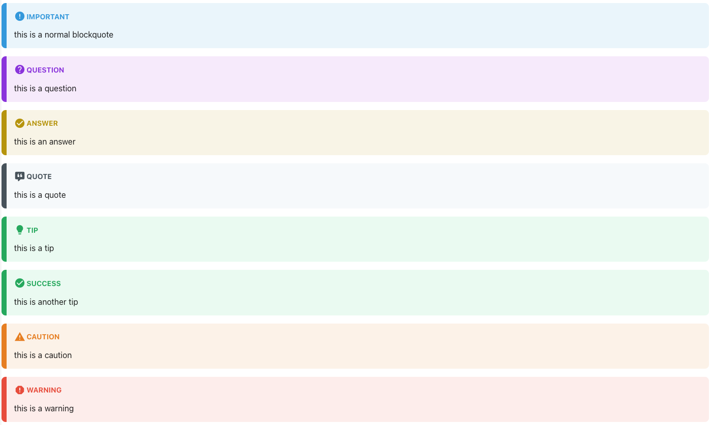

# Remark Blockquotes Extended

This remarkjs plugin extends blockquote formatting for markdown documents. Currently users can create formatted blockquote sections for:

- CAUTION
- IMPORTANT
- QUESTION & ANSWER
- QUOTE
- SUCCESS
- TIP
- WARNING



## Installation

```bash
npm install --save remark-blockquotes-extended
```

## Document Formatting

This plugin searches uses the following strings to format the markdown document blockquotes with the extended features:

|   Type    | Characters |
|:---------:|------------|
|  Answer   | a> or A>   |
|  Caution  | c> or C>   |
| Important | >          |
| Question  | ?>         |
|   Quote   | q> or Q>   |
|  Success  | s> or S>   |
|    Tip    | t> or T>   |
|  Warning  | w> or W>   |

## Additional Plugins

This plugin parses the markdown document and edits the tree with custom formatting. To format the tree in HTML, please use the `rehype-blockquote-extended` plugin.

## Legal

This software is distributed free of cost and does not provide support or warranty to the end user or developer. 